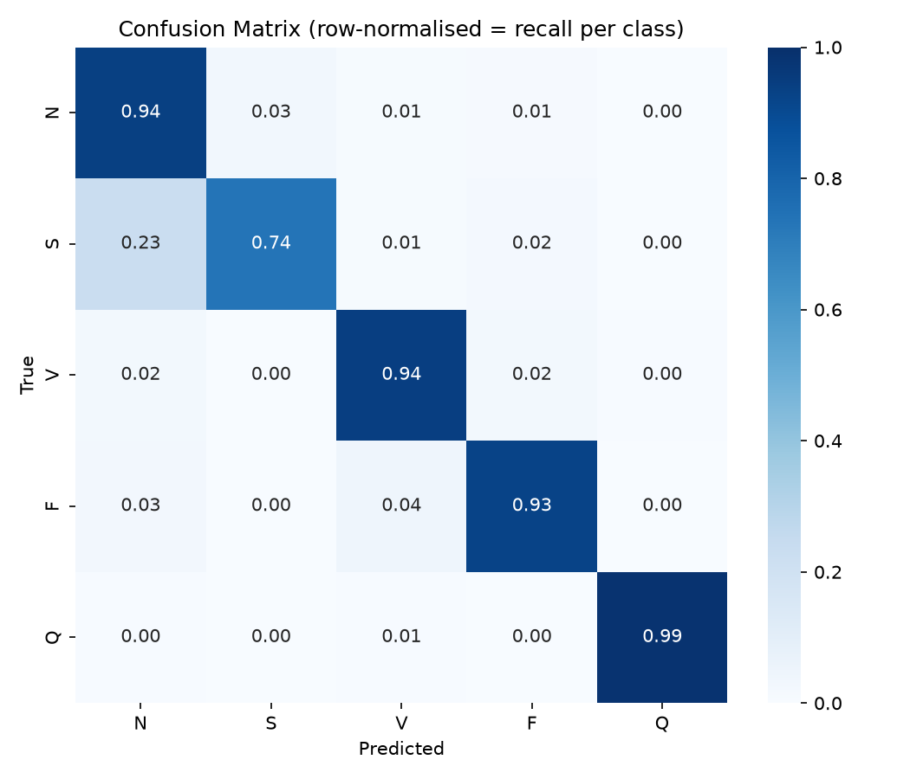

# ECG Arrhythmia Classification API

[](https://github.com/adamelkadri/ecg-arrhythmia-classification-api/actions/workflows/ci.yml)

End-to-end deep learning project that classifies ECG heartbeats into five
arrhythmia categories using a **1D Convolutional Neural Network** built in
**PyTorch**, then serves predictions through a **FastAPI** REST API packaged in
**Docker**.

---

## Overview

- **Task:** classify a single ECG heartbeat into one of 5 classes (N, S, V, F, Q).
- **Data:** MIT-BIH Arrhythmia dataset (Kaggle "Heartbeat" CSV version).
- **Model:** 3-block 1D CNN (Conv1d → BatchNorm → ReLU → Pooling) + MLP head.
- **Imbalance handling:** inverse-frequency class-weighted loss (or a
  `WeightedRandomSampler`, switchable in `src/config.py`).
- **Evaluation:** accuracy, per-class precision/recall/F1, **macro-F1**, and a
  confusion matrix — appropriate for a heavily imbalanced medical dataset.
- **Serving:** FastAPI `/predict` + `/health` endpoints, containerised with Docker.

```
ecg-arrhythmia-classification-api/
├── README.md
├── requirements.txt
├── Dockerfile
├── .dockerignore
├── .gitignore
├── data/                  # CSVs go here (not committed) — see data/README.md
├── notebooks/
│   └── 01_exploration_training.ipynb
├── src/
│   ├── config.py          # paths + hyperparameters (single source of truth)
│   ├── dataset.py         # ECGDataset + DataLoaders + class weights
│   ├── model.py           # ECGCNN (1D CNN)
│   ├── train.py           # training loop, saves best model
│   ├── evaluate.py        # metrics + confusion matrix
│   ├── predict.py         # load model + classify one heartbeat
│   └── utils.py           # seeding, device selection
├── app/
│   └── main.py            # FastAPI application
├── tests/
│   ├── conftest.py        # shared fixtures + sys.path setup
│   ├── test_dataset.py    # Dataset/DataLoader shapes, class weights
│   ├── test_model.py      # CNN input/output shapes
│   └── test_api.py        # /health + /predict (TestClient)
├── Makefile               # install / test / train / evaluate / serve / docker
├── pytest.ini
├── models/
│   └── ecg_cnn.pt         # trained weights (created by training)
└── results/
    ├── classification_report.txt
    └── confusion_matrix.png
```

---

## Dataset

MIT-BIH Arrhythmia — Kaggle [ECG Heartbeat Categorization Dataset](https://www.kaggle.com/datasets/shayanfazeli/heartbeat).

Each row is one heartbeat: **187 signal samples** (already amplitude-normalised
to ~[0, 1] and zero-padded) + **1 integer label**.

| Label | Symbol | Meaning |
|-------|--------|---------|
| 0 | N | Normal beat |
| 1 | S | Supraventricular ectopic beat |
| 2 | V | Ventricular ectopic beat |
| 3 | F | Fusion beat |
| 4 | Q | Unknown / unclassifiable beat |

The dataset is **heavily imbalanced** (class N dominates), which is why macro-F1
and per-class recall are the headline metrics rather than raw accuracy.

**Download:** see [`data/README.md`](data/README.md). Place `mitbih_train.csv`
and `mitbih_test.csv` in `data/`.

---

## Model architecture

Input `(batch, 1, 187)` → logits `(batch, 5)`.

```
Conv1d(1  → 32, k=5) → BatchNorm → ReLU → MaxPool(2)     # (B, 32, 93)
Conv1d(32 → 64, k=5) → BatchNorm → ReLU → MaxPool(2)     # (B, 64, 46)
Conv1d(64 →128, k=3) → BatchNorm → ReLU → AdaptiveAvgPool(1)  # (B, 128, 1)
Flatten → Dropout → Linear(128 → 64) → ReLU → Dropout → Linear(64 → 5)
```

**44,229** trainable parameters (printed by `python -m src.model`).

---

## Results

Test set: 21,892 heartbeats. Best model selected by validation macro-F1 (epoch 21).

| Metric | Value |
|--------|-------|
| Test accuracy | **93.8%** |
| Macro-F1 | **0.771** |
| Weighted-F1 | 0.946 |

| Class | Precision | Recall | F1 | Support |
|-------|-----------|--------|------|---------|
| N — Normal | 0.99 | 0.94 | 0.96 | 18,118 |
| S — Supraventricular | 0.40 | 0.74 | 0.52 | 556 |
| V — Ventricular | 0.87 | 0.94 | 0.90 | 1,448 |
| F — Fusion | 0.34 | 0.93 | 0.49 | 162 |
| Q — Unknown | 0.97 | 0.99 | 0.98 | 1,608 |

**Reading the per-class numbers:** with inverse-frequency class weighting, the
model achieves **high recall on the rare arrhythmia classes** — it catches 74% of
Supraventricular (S) and 93% of Fusion (F) beats despite them being <1% of the
data. The trade-off is lower precision on those classes (more false positives),
which is the safer error to make for a screening tool: flagging a healthy beat
for review is far less costly than missing a real arrhythmia. This is exactly
why **macro-F1 (0.771)**, which weights every class equally, is the headline
metric rather than raw accuracy (which the dominant Normal class would inflate).



**How to read it:** the confusion matrix is row-normalised, so each diagonal
cell is that class's **recall**. Watch the minority classes (S, F especially) —
high overall accuracy can hide poor recall there, which is exactly what matters
clinically.

---

## Setup

```bash
# 1. (recommended) create a virtual environment
python -m venv .venv && source .venv/bin/activate

# 2. install dependencies
pip install -r requirements.txt

# 3. download the dataset into data/  (see data/README.md)
```

## Run training

```bash
python -m src.train
```
Trains the CNN, keeps the best epoch by **validation macro-F1**, and saves
`models/ecg_cnn.pt`. Tune hyperparameters in `src/config.py`.

## Run evaluation

```bash
python -m src.evaluate
```
Writes `results/classification_report.txt` and `results/confusion_matrix.png`,
and prints accuracy + macro-F1.

## Quick CLI prediction

```bash
python -m src.predict   # classifies the first row of the test set
```

## Run the API

```bash
uvicorn app.main:app --reload
# open http://127.0.0.1:8000/docs  for interactive Swagger UI
```

### Example request

```bash
curl -X POST http://127.0.0.1:8000/predict \
  -H "Content-Type: application/json" \
  -d "{\"signal\": [$(python -c 'print(",".join(["0.0"]*187))')]}"
```

### Example response

```json
{
  "predicted_class": 0,
  "predicted_class_name": "N",
  "predicted_class_description": "Normal beat",
  "confidence": 0.98,
  "class_probabilities": {
    "N": 0.98, "S": 0.01, "V": 0.005, "F": 0.003, "Q": 0.002
  }
}
```

---

## Tests

The suite is lightweight and **needs no dataset and no trained model** — it uses
dummy tensors, monkeypatches the CSV loader, and swaps in a random-weight model
for the API prediction test.

```bash
pip install -r requirements.txt   # includes pytest + httpx
pytest                            # or: make test
```

What's covered:
- `test_dataset.py` — `ECGDataset` returns `(1, 187)` float32 tensors + scalar
  long labels; class weights are balanced→~1 and up-weight rare classes;
  `build_dataloaders` yields correctly shaped batches (CSV loader monkeypatched).
- `test_model.py` — `ECGCNN` maps `(B, 1, 187) → (B, 5)`, handles batch size 1,
  produces finite outputs, and has trainable parameters.
- `test_api.py` — `/health` returns 200; `/predict` returns the full response
  schema on valid input, **422** on empty/missing/wrong-type input, and **503**
  when no model file is available.

**How the API test bypasses model loading:** `src/predict.py` calls
`load_model()` as a module-level global, so a test just does
`monkeypatch.setattr("src.predict.load_model", lambda: untrained_model)`. The
real forward + softmax + response-building code still runs — only the weight
file read is skipped. See `tests/test_api.py`.

---

## Docker

```bash
# Build (run AFTER training so models/ecg_cnn.pt exists)
docker build -t ecg-api .

# Run
docker run -p 8000:8000 ecg-api

# Test
curl http://127.0.0.1:8000/health
```

`GET /health` returns `{"status": "ok", "model_loaded": true}` once weights are
present in the image.

---

## Limitations & future improvements

- **Single-beat, pre-segmented input** — real ECG monitoring needs an upstream
  R-peak detector / beat segmentation step before this model.
- **Inter-patient generalisation** — the standard Kaggle split mixes beats from
  the same patients across train/test; a patient-wise split is harder and more
  honest.
- **Minority-class recall** — even with class weighting, F and S beats are
  hard; worth trying focal loss, SMOTE-style augmentation, or signal jittering.
- **Model size** — a deeper ResNet-1D or adding residual connections may help.
- **Serving** — add batching, ONNX/TorchScript export for faster inference, and
  request logging / monitoring for production.

---

## CV bullet points

- Built an end-to-end ECG arrhythmia classifier in **PyTorch**, training a 1D
  CNN (44k params) on the MIT-BIH dataset (~109k heartbeats, 5 classes) to
  **93.8% test accuracy and 0.77 macro-F1**, explicitly handling 113× class
  imbalance with inverse-frequency weighted loss to reach 74–93% recall on rare
  arrhythmia classes.
- Designed a clean, reproducible ML codebase (config-driven training, seeded
  runs, best-checkpoint selection by validation macro-F1, per-class
  precision/recall/F1 + confusion-matrix evaluation) with a **17-test pytest
  suite and GitHub Actions CI**, separating notebook exploration from production
  `src/` modules.
- Deployed the trained model as a **FastAPI** REST service with Pydantic
  validation and a `/predict` endpoint, **containerised with Docker** for
  reproducible, portable inference.

---

## License

MIT — see dataset terms on Kaggle for data usage.
